# IA651 Final Project

## Project Description
This is the final project for the course ia651 (Applied Machine Learning) of Clarkson University (Spring 2023). The goal for the final project is to select an appropriate private or public dataset and build a predictive model for it. Data cleaning, exploration and preparing should be done to prepare the data to build the prediction model. 

For the selected Airbnb dataset start with being familiar with dataset, cleaning dataset, exploring and explaining, finding relations and building model and doing prediction. 

## NYC Airbnb listing Dataset
Airbnb is an online marketplace that connects people who are looking for a place to stay with people who have extra space to rent out. It was founded in 2008 and has since grown into a global platform with listings in over 220 countries and regions. On Airbnb, hosts can list their homes, apartments, guesthouses, or other types of accommodations, and travelers can search for and book these spaces for short-term stays. Airbnb also offers experiences and activities hosted by local experts in various locations, allowing travelers to immerse themselves in the culture and community of their destination.

The Airbnb NYC listing dataset is a collection of information about listings in New York City that are available on the Airbnb platform. It contains information such as the location, type of accommodation, price, number of bedrooms, amenities, availability, and reviews from guests. The dataset was first released in 2015 and has been updated annually since then.

The dataset is publicly available and has been used by researchers to analyze various aspects of the Airbnb market in New York City. For example, researchers have used the dataset to study the impact of Airbnb on the housing market, the distribution of listings across neighborhoods, and the characteristics of hosts and guests. The dataset includes information on over 50,000 listings in New York City, making it one of the largest Airbnb datasets available.

## Resources
**Dataset** : [NYC Airbnb 2023](http://insideairbnb.com/get-the-data)

**Python Version** : 3.11

**Packages**: Numpy, Pandas, Keras, Matplotlib, Scikit, Seaborn, WordCould, tabulate

**IDE** : Visual Studio Code, Jupyter Notebook


## Dataset features

List of the important features which we will use in this project.

* **id**: A unique identifier for each Airbnb listing.
* **name**: The name or title of the Airbnb listing.
* **host_id**: A unique identifier for the host of the Airbnb listing.
* **host_name**: The name of the host of the Airbnb listing.
* **neighbourhood_group**: The borough (i.e. neighborhood group) in which the Airbnb listing is located.
* **neighbourhood**: The specific neighborhood in which the Airbnb listing is located.
* **latitude**: The latitude coordinate of the Airbnb listing's location.
* **longitude**: The longitude coordinate of the Airbnb listing's location.
* **room_type**: The type of room or space that is being rented (e.g. Entire home/apt, Private room, Shared room).
* **price**: The nightly price for the Airbnb listing.
* **minimum_nights**: The minimum number of nights that a renter must stay in the Airbnb listing.
* **number_of_reviews**: The number of reviews that the Airbnb listing has received.
* **last_review**: The date of the most recent review of the Airbnb listing.
* **reviews_per_month**: The average number of reviews per month for the Airbnb listing.
* **availability_365**: The number of days that the Airbnb listing is available for rent during the next 365 days.

* **amenities**: List of amenities reported by the host.
* **bedrooms**: number of bedrooms available for use.
* **beds**: number of beds.
* **bathrooms**: number of bathrooms available for use.
* **accommodates**: number of people who can use the listing

## Data cleaning

The first step is to know the dataset itself and it's general status. 


```python
import pandas as pd
import warnings
warnings.filterwarnings('ignore')

df = pd.read_csv('./data/listings.csv')
df.shape
```


    (42931, 75)


the result shows the dimension of our data. Among 75 feature we use ones we described before


```python
df = df[['id', 'host_since', 'host_response_rate', 'host_acceptance_rate', 'host_is_superhost', 'neighbourhood_cleansed', 'neighbourhood_group_cleansed', 'latitude', 'longitude', 'room_type', 'accommodates', 'bathrooms', 'bedrooms', 'beds', 'amenities', 'price', 'availability_365', 'number_of_reviews', 'review_scores_rating', 'reviews_per_month', 'minimum_nights', 'maximum_nights']]
```

before everything is better to check the status of nulls in our dataset:


```python
#summarize of null cells:
df.isnull().sum()
```


    id                                  0
    host_since                          5
    host_response_rate              14532
    host_acceptance_rate            12564
    host_is_superhost                  25
    neighbourhood_cleansed              0
    neighbourhood_group_cleansed        0
    latitude                            0
    longitude                           0
    room_type                           0
    accommodates                        0
    bathrooms                       42931
    bedrooms                         3874
    beds                              929
    amenities                           0
    price                               0
    availability_365                    0
    number_of_reviews                   0
    review_scores_rating            10304
    reviews_per_month               10304
    minimum_nights                      0
    maximum_nights                      0
    dtype: int64


the **bathrooms** feature is most of the times null so it's better to drop it:


```python
df = df.drop(['bathrooms'], axis = 1)
```

Then we check to see is there any duplicate data or not:


```python
# Check for duplicates
print(df.duplicated().sum())
```

    0
    

To know more about the features lets check the data types:


```python
df.dtypes
```


    id                                int64
    host_since                       object
    host_response_rate               object
    host_acceptance_rate             object
    host_is_superhost                object
    neighbourhood_cleansed           object
    neighbourhood_group_cleansed     object
    latitude                        float64
    longitude                       float64
    room_type                        object
    accommodates                      int64
    bedrooms                        float64
    beds                            float64
    amenities                        object
    price                            object
    availability_365                  int64
    number_of_reviews                 int64
    review_scores_rating            float64
    reviews_per_month               float64
    minimum_nights                    int64
    maximum_nights                    int64
    dtype: object


Features **host_response_rate**, **host_acceptance_rate**, **host_is_superhost** and **price** should be numbers. Here we convert them to numbers:             


```python
# Replacing the '$' sign with an empty string in the 'price' column
df['price'] = df['price'].str.replace('$', '')

# Removing commas from the 'price' column
df['price'] = df['price'].str.replace(',', '')

# Converting the 'price' column to float
df['price'] = df['price'].astype(float)
```


```python
# Replacing the '%' sign with an empty string in the 'host_response_rate' column
df['host_response_rate'] = df['host_response_rate'].str.replace('%', '')

# Converting the 'host_response_rate' column to float
df['host_response_rate'] = df['host_response_rate'].astype(float)
```


```python
# Replacing the '%' sign with an empty string in the 'host_acceptance_rate' column
df['host_acceptance_rate'] = df['host_acceptance_rate'].str.replace('%', '')

# Converting the 'host_response_rate' column to float
df['host_acceptance_rate'] = df['host_acceptance_rate'].astype(float)
```

fo the **host_is_superhost** column the data is in the format of t(true) and f(false). we replace them with 0 for flase and 1 for true:


```python
#Replacing t with 1 and f with 0
df['host_is_superhost'] = df['host_is_superhost'].map({'t': 1, 'f': 0})

#converting data to float format
#Here we converte data to float becuase we want to do nothing with null values
df['host_is_superhost'] = df['host_is_superhost'].astype(float) 
```

The last feature which needs some action is **host_since** column. This column shows the listing joining time to Airbnb but in the object data type. Here we convert it to datetime format:


```python
df['host_since'] = pd.to_datetime(df['host_since'])
```

- **Amenities** :

this table can help us to know more about the listing. Let's see how many different types of amenities we have in this datatset:


```python
import re

unique_amenities = set()

for index, row in df.iterrows():
    amenities_list = re.findall('"([^"]*)"', row['amenities'])
    # add each amenity to the unique_amenities set
    for amenity in amenities_list:
        unique_amenities.add(amenity)

print('the number of unique amenities by name: ', len(unique_amenities))
```

    the number of unique amenities by name:  5465
    

There are 5465 different amenities name in the column and if we chack them most of them are duplicated. With some tries we created a standardized dictionary which has the key words for the strings that present similar amenity.

for example the key word wifi is replaced with diffrent presentation of wifi in amenities.


```python
#dictionary of standardized amenities
standardized_amenities = {
    'wifi': 'Wifi',
    'tv': 'TV',
    'cable tv': 'TV',
    'oven': 'Oven',
    'gas oven': 'Oven',
    'stove': 'Stove',
    'gas stove': 'Stove',
    'conditioner': 'Conditioner',
    'shampoo' : 'Shampoo',
    'soap' : 'Soap',
    'sound system': 'Sound system',
    'refrigerator' : 'Refrigerator',
    'pool': 'pool',
    'pool' : 'pool',
    'bbq' : 'BBQ',
    'book': 'Book',
    'coffee': 'Coffee',
    'clothing': 'Clothing',
    'exercise equipment' : 'Exercise equipment',
    'game' : 'Game', 
    'fireplace' : 'Fireplace',
    'parking' : 'Parking',
    'garage' : 'Garage',
    'crib' : 'Crib',
    'dryer' : 'Dryer',
    'washer' : 'Washer',
    'backyard' : 'Backyard',
    'gym' : 'Gym',
    'ev charger' : 'EV Cahrger',
    'hot tub' : 'Hot-Tube',
    'high chair' : 'High chair',
    'carport' : 'Carport',
    'baby bath' : 'Baby bath',
    'baby monitor' : 'Baby monitor',
    'beach access' : 'Beach access',
    'changing table' : 'changing table',
    
    
}


unique_amenities = set()


for index, row in df.iterrows():
    amenities_list = re.findall('"([^"]*)"', row['amenities'])
    # standardize the amenities
    standardized_list = []
    for amenity in amenities_list:
        amenity_lower = amenity.lower()
        for key, value in standardized_amenities.items():
            if key in amenity_lower:
                standardized_list.append(value)
                break
        else:
            standardized_list.append(amenity)
        standardized_list = [amenity for amenity in standardized_list if not amenity.endswith('\\')]
        standardized_list = [amenity for amenity in standardized_list if not amenity.endswith(', ')]
    # add each standardized amenity to the unique_amenities set
    for amenity in standardized_list:
        unique_amenities.add(amenity)


print('The number of unique amenities after standardizing them: ', len(unique_amenities))
```

    The number of unique amenities after standardizing them:  212
    

Let's see what are the unique amenities which we found:


```python
print(unique_amenities)
```

    {'Onsite restaurant \\u2014 Trademark Taste', 'Garden view', 'Beach essentials', 'Toiletries', 'Book', 'Paid resort access', 'Bed sheets and pillows', 'Malin+Goetz toiletries', 'Waterfront', 'City skyline view', 'Bottled water', 'Cooking basics', 'Safe', 'Private sauna', 'Smart lock', 'Outdoor kitchen', 'Onsite rooftop bar \\u2014 cloudM', 'Hot water kettle', 'Bread maker', 'Baby bath', 'Lockbox', 'Desert view', 'Garnier-Thiebaut linens', 'Essentials', 'Baking sheet', 'Bidet', 'Coffee', 'C.O. Bigelow Apothecary toiletries', 'Dishes and silverware', 'Onsite restaurant \\u2014 Garden', 'Onsite restaurant \\u2014 CanteenM-open 24/7', 'Concierge', 'Resort access', 'Game', 'Exercise equipment', 'Table corner guards', 'Garden', 'Private patio or balcony', 'Bay view', 'Valley view', 'Luggage dropoff allowed', 'Self check-in', 'Outlet covers', 'Limited housekeeping \\u2014 weekly', 'Security cameras on property', 'Onsite bar', 'Outdoor dining area', 'Onsite bar \\u2014 Overstory', 'Kitchenette', 'First aid kit', 'Outdoor furniture', 'Beach access', 'Laundry services', 'Children\\u2019s dinnerware', 'Rice maker', 'Ethernet connection', 'House bikes', 'MOR toiletries', 'Trash compactor', 'Lake view', 'Turndown service', 'Breakfast', 'Shared outdoor kitchen', 'Hot breakfast available \\u2014 $20 per person per day', 'Building staff', 'Courtyard view', 'Lock on bedroom door', 'EV Cahrger', 'Sferra linens', 'Shampoo', 'Refrigerator', 'Le Labo toiletries', 'Acca Kappa toiletries', 'changing table', 'Mini fridge', 'Outdoor shower', 'Portable air conditioning', 'Onsite restaurant \\u2014 Churrascaria Plataforma', 'Complimentary continental breakfast', 'Dedicated workspace', 'Onsite bar \\u2014 Molyvos Restaurant - Bar', 'Wifi', 'Window AC unit', 'Backyard', 'Extra pillows and blankets', 'Lake access', 'Elevator', 'Room service', 'Wine glasses', 'Onsite restaurant \\u2014 Blue Ribbon', 'Air conditioning', 'Beach view', 'Shower gel', 'Radiant heating', 'Sea view', 'Garage', 'Laundromat nearby', 'Onsite bar \\u2014 Osteria Lumaca', 'Mountain view', 'C.O. Bigelow toiletries', 'Kayak', 'ReVolve toiletries', 'Breakfast buffet available \\u2014 $15 per person per day', 'Breakfast available for a fee', 'Baby monitor', '24-hour fitness center', 'Harbor view', 'Ski-in/ski-out \\u2013 Near ski lifts', 'Private entrance', 'Spa', 'Portable fans', 'Continental breakfast available \\u2014 $13 per person per day', 'pool', 'Private outdoor kitchen', 'Bikes', 'Onsite restaurant \\u2014 Blue Ribbon Sushi Izakaya', 'Crib', 'Host greets you', 'Onsite restaurant \\u2014 Mykonos Bleu Restaurant & Rooftop', 'Room-darkening shades', 'Dining table', 'Microwave', 'Barbecue utensils', 'Steam room', 'Limited housekeeping \\u2014 on request', 'Housekeeping', 'Onsite restaurant \\u2014 Crown Shy', 'Iron', 'Cleaning products', 'Fire extinguisher', 'Central heating', 'Smoking allowed', 'Restaurant', 'Central air conditioning', 'Heating', 'Sauna', 'Private living room', 'Fireplace', 'Gym', 'Free resort access', 'Fire pit', 'Stove', 'Onsite rooftop bar \\u2014 Make Believe', 'Toaster', 'Clothing', 'Golf course view', 'Cooked-to-order breakfast available \\u2014 $15 per person per day', 'Park view', 'Washer', 'Freezer', 'Parking', 'Piano', 'Long term stays allowed', 'Dryer', 'Minibar', 'Single level home', 'Cooked-to-order breakfast available for a fee', 'Babysitter recommendations', 'Bluetooth speaker', 'Window guards', 'Hot water', 'Canal view', 'Onsite rooftop bar \\u2014 Last Light', 'Heating - split type ductless system', 'Onsite rooftop bar \\u2014 Mykonos Bleu Restaurant & Rooftop', 'Marina view', 'Oven', 'Frette linens', 'Hot-Tube', 'Airport shuttle', 'Sun loungers', 'AC - split type ductless system', 'TV', 'Ceiling fan', 'Baby safety gates', 'Boat slip', 'Onsite restaurant \\u2014 The Press Lounge', 'Resort view', 'Ping pong table', 'Keypad', 'Bathrobes', 'Carbon monoxide alarm', 'Smoke alarm', 'High chair', 'Portable heater', 'Bed linens', 'Bathtub', 'Sound system', 'Hangers', 'Shared patio or balcony', 'Nespresso machine', 'Kitchen', 'Cleaning available during stay', 'Pets allowed', 'Ocean view', 'River view', 'Onsite bar \\u2014 Cafe', 'Carport', 'Slippers', 'Patio or balcony', 'Hammock', 'BBQ', 'Blender', 'Conditioner', 'Ski-in/Ski-out', 'Shared sauna', 'Complimentary breakfast', 'Record player', 'Soap', 'Fitness center', 'Vineyard view', 'Mosquito net'}
    

We hot encode the amenities and add them to our dataframe:


```python
# creating one-hot encoded columns for each unique amenity
for amenity in unique_amenities:
    df[amenity] = df['amenities'].str.contains(amenity).astype(int)

# droping the original amenities column
df.drop('amenities', axis=1, inplace=True)
```

## Data exploration

After cleaning and preparing the dataset in this part we try to explore the data and features.

First we focus on **numerical features**: 

**1- Price**

We start with the most important feature for us (price), since we want to build a model for price prediction:


```python
# Exploring the 'price' column
print(df['price'].describe())
```

    count    42931.000000
    mean       200.307167
    std        895.082911
    min          0.000000
    25%         75.000000
    50%        125.000000
    75%        200.000000
    max      99000.000000
    Name: price, dtype: float64
    

the result shows some outliers. There are some listings with zero prices and some others with very high value for prices. We consider these records as outliers. Let's check how many records we have with '0' value for price:


```python
df[df['price'] == 0].shape
```


    (27, 232)


Just 27 records. We drop these records:


```python
df = df[df['price'] > 0]
```

Here we want to find the listings with prices more than 2000$:


```python
import matplotlib.pyplot as plt


# Displaying the box plot
df['price'].plot(kind='box', vert=False, figsize=(15,3))
plt.show()

# Calculating the number and the percentage of prices that are equal to  500.00
print('Values over $2000.00: ')
print(len(df[df['price'] > 2000]))
print('{:.4f}%'.format((len(df[df['price'] > 2000]) / df.shape[0]) * 100));
```


    
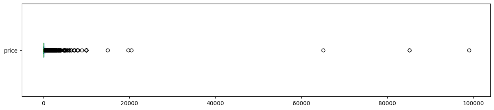
    


    Values over $2000.00: 
    175
    0.4079%
    

Seems 2000$ is a good choice to drop listings with higher prices:


```python
df = df[(df['price'] <= 2000)].reset_index()
```

**2- minimum_nights**

Let's see see the description for **minimum_nights** column:


```python
print(df['minimum_nights'].describe())
```

    count    42729.000000
    mean        18.117461
    std         27.381428
    min          1.000000
    25%          2.000000
    50%          8.000000
    75%         30.000000
    max       1250.000000
    Name: minimum_nights, dtype: float64
    

maximum value seems a bit strange here we plot boxplot for the minimum_nights column:


```python
df['minimum_nights'].plot(kind='box', vert=False, figsize=(15,3))
plt.show();
```


    
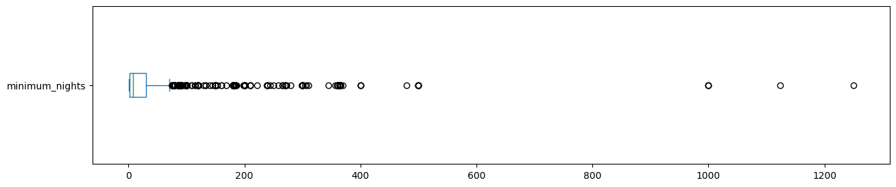
    


Seems we can consider more than 400 nights as outliers. Let's check how many samples are bigger than 400:


```python
print('records with minimum nights over 400: ')
print(len(df[df['minimum_nights'] > 400]))
print('{:.4f}%'.format((len(df[df['minimum_nights'] > 400]) / df.shape[0]) * 100))
```

    records with minimum nights over 400: 
    12
    0.0281%
    

just 12 records. Then, we remove them from the dataframe:


```python
df = df[(df['minimum_nights'] <= 400)].reset_index()
```

let's plot the histogram chart for minimum_nights to know more about the distribution of data:


```python
df.hist(column='minimum_nights', bins=50);
```


    
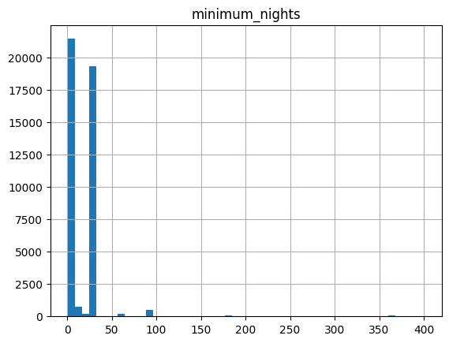
    


We can see that there are some specific number of nights with much more accurance than others. Let's see what are this values:


```python
df['minimum_nights'].value_counts()
```


    30     18182
    1       7846
    2       5507
    3       3805
    5       1496
           ...  
    345        1
    92         1
    98         1
    140        1
    244        1
    Name: minimum_nights, Length: 122, dtype: int64


The minimum_nights = 30 has the most occurance and after than 1 nights. Let's aagin check how many records there are with minimum_nights more than 30 nights:


```python
print('records with minimum nights over 30: ')
print(len(df[df['minimum_nights'] > 30]))
print('{:.4f}%'.format((len(df[df['minimum_nights'] > 30]) / df.shape[0]) * 100))
```

    records with minimum nights over 30: 
    1866
    4.3683%
    

about 5% of listings. Let's keep these records maybe later we need them.

**3- maximum_nights**

The column description:


```python
print(df['maximum_nights'].describe())
```

    count    4.271700e+04
    mean     5.177731e+04
    std      1.039123e+07
    min      1.000000e+00
    25%      6.000000e+01
    50%      3.650000e+02
    75%      1.125000e+03
    max      2.147484e+09
    Name: maximum_nights, dtype: float64
    

Some big and strange values exist. Let's see what is the 99 percentile of maximum_nights column:


```python
percentile_99 = df['maximum_nights'].quantile(0.99)
print('99th percentile for maximum_nights column is: ', percentile_99)
```

    99th percentile for maximum_nights column is:  1125.0
    

Let's drop records with maximum_nights more than 1125:


```python
df = df[(df['maximum_nights'] <= percentile_99)]
```

poxplot for maximum_nights:


```python
df['maximum_nights'].plot(kind='box', vert=False, figsize=(15,3))
plt.show();
```


    
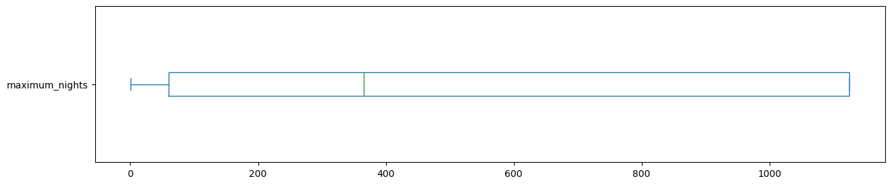
    


Let's try to show the data in a different way to know more about maximum_nights:


```python
df.hist(column='maximum_nights', bins=50);
```


    
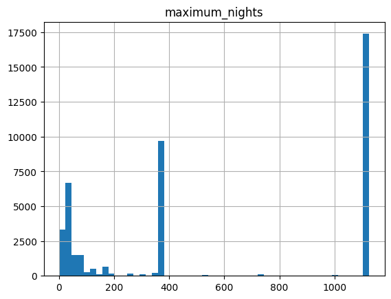
    


similar to the minimum_nights column here we have some values which repeated far more than others. Let's see what are they:


```python
df['maximum_nights'].value_counts()
```


    1125    17211
    365      9550
    30       2585
    28       1615
    90       1329
            ...  
    238         1
    173         1
    1114        1
    107         1
    244         1
    Name: maximum_nights, Length: 245, dtype: int64


Seems 1125 is a default maximum value that some listings using this number and it has the most occurance. After that, one year,one month and three monthes have the most occurances.

It's good to know how many listings allow the people to stay just one day:


```python
print('Number of listings with maximum night eqaul to 1: ', df['maximum_nights'].value_counts()[1])
```

    Number of listings with maximum night eqaul to 1:  52
    

**3- availability_365**

column description:


```python
print(df['availability_365'].describe())
```

    count    42705.000000
    mean       140.112750
    std        141.918569
    min          0.000000
    25%          0.000000
    50%         88.000000
    75%        288.000000
    max        365.000000
    Name: availability_365, dtype: float64
    

There are some listings with zero availability. Let's see how many records they are:


```python
print('Number of listings with zero availability: ', df['availability_365'].value_counts()[0] )
```

    Number of listings with zero availability:  13912
    

It's better to keep these listings.

**4- Latitude**:

Description for the column:


```python
print(df['latitude'].describe())
```

    count    42705.000000
    mean        40.728244
    std          0.057697
    min         40.500314
    25%         40.687420
    50%         40.723945
    75%         40.762295
    max         40.911380
    Name: latitude, dtype: float64
    

records are normal with a small standard deviation.

**5- longitude:**

Description for the column:


```python
print(df['longitude'].describe())
```

    count    42705.000000
    mean       -73.943504
    std          0.056639
    min        -74.251907
    25%        -73.981620
    50%        -73.952500
    75%        -73.923880
    max        -73.710870
    Name: longitude, dtype: float64
    

for the longitude column similar the the latitude column records are normal. Let's plot latitude-longitude chart:


```python
plt.figure(figsize=(10,8))
plt.scatter(df['longitude'],df['latitude'], s = 2) # s is a size of marker
plt.xlabel('longitude')
plt.ylabel('Latitude')
plt.show();
```


    
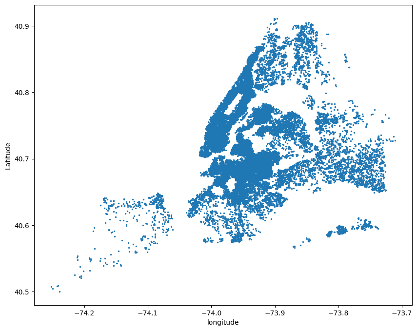
    


**6- host_response_rate**

The description for the column:


```python
print(df['host_response_rate'].describe())
```

    count    28262.000000
    mean        94.432524
    std         16.070011
    min          0.000000
    25%         99.000000
    50%        100.000000
    75%        100.000000
    max        100.000000
    Name: host_response_rate, dtype: float64
    

the distribution for the column:


```python
df.hist(column='host_response_rate', bins=50);
df['host_response_rate'].value_counts()
```


    100.0    20692
    90.0       869
    99.0       772
    94.0       519
    98.0       499
             ...  
    55.0         2
    24.0         1
    61.0         1
    36.0         1
    5.0          1
    Name: host_response_rate, Length: 73, dtype: int64


    
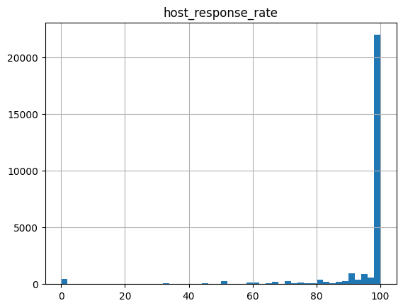
    


Let's see how many hosts do not response to the requests at all:


```python
print('Number of listings with zero host_response_rate: ', df['host_response_rate'].value_counts()[0] )
```

    Number of listings with zero host_response_rate:  428
    

**7- host_acceptance_rate:**

Here is the description for the column:


```python
print(df['host_acceptance_rate'].describe())
```

    count    30227.000000
    mean        83.640851
    std         25.279805
    min          0.000000
    25%         78.000000
    50%         96.000000
    75%        100.000000
    max        100.000000
    Name: host_acceptance_rate, dtype: float64
    

The distribution for the column:


```python
df.hist(column='host_acceptance_rate', bins=50);
df['host_acceptance_rate'].value_counts()
```


    100.0    9661
    99.0     1970
    97.0     1746
    98.0     1322
    0.0       897
             ... 
    15.0        7
    4.0         6
    7.0         4
    26.0        4
    6.0         1
    Name: host_acceptance_rate, Length: 98, dtype: int64


    
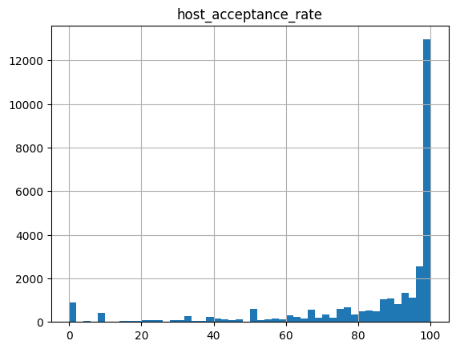
    


The number and percentage of rejecting reuqests:


```python
print('number of records with acceptance rate equal to zero: ')
print(len(df[df['host_acceptance_rate'] == 0]))
print('{:.4f}%'.format((len(df[df['host_acceptance_rate'] == 0]) / df.shape[0]) * 100))
```

    number of records with acceptance rate equal to zero: 
    897
    2.1005%
    

**8- bedrooms:**

The description for bedrooms:


```python
print(df['bedrooms'].describe())
```

    count    38876.000000
    mean         1.393971
    std          0.781390
    min          1.000000
    25%          1.000000
    50%          1.000000
    75%          2.000000
    max         16.000000
    Name: bedrooms, dtype: float64
    

Distribution of number of bedrooms:


```python
df.hist(column='bedrooms', bins=20);
df['bedrooms'].value_counts()
```


    1.0     28665
    2.0      6535
    3.0      2655
    4.0       756
    5.0       178
    6.0        64
    7.0         9
    8.0         6
    9.0         5
    11.0        2
    16.0        1
    Name: bedrooms, dtype: int64


    
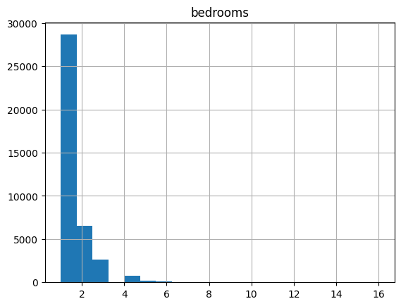
    


The number of listings which have more than 3 bedrooms:


```python
print(len(df[df['bedrooms'] > 3]))
print('{:.4f}%'.format((len(df[df['bedrooms'] > 3]) / df.shape[0]) * 100))
```

    1021
    2.3908%
    

Since we want to predict price, we consider more than 3 bedrooms as outliers for our dataset and remove them:


```python
df = df[(df['bedrooms'] < 4)]
```

**9- beds:**

Description for the column:


```python
print(df['beds'].describe())
```

    count    37096.000000
    mean         1.606211
    std          0.987283
    min          1.000000
    25%          1.000000
    50%          1.000000
    75%          2.000000
    max         11.000000
    Name: beds, dtype: float64
    

The distribution for the number of beds:


```python
df.hist(column='beds', bins=20);
df['beds'].value_counts()
```


    1.0     23220
    2.0      8404
    3.0      3481
    4.0      1313
    5.0       369
    6.0       220
    7.0        46
    8.0        23
    9.0        14
    11.0        4
    10.0        2
    Name: beds, dtype: int64


    
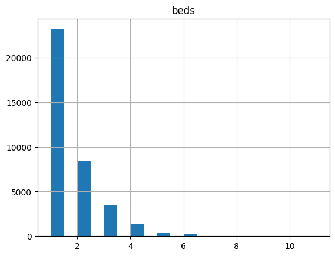
    


We consider more than 6 beds as outliers and remove them from the dataset:


```python
df = df[(df['beds'] < 7)]
```

**10- accomodates:**

The description for the column:


```python
print(df['beds'].describe())
```

    count    37007.000000
    mean         1.591267
    std          0.938749
    min          1.000000
    25%          1.000000
    50%          1.000000
    75%          2.000000
    max          6.000000
    Name: beds, dtype: float64
    

everything seems clear for this column.

#### Numberical features relations:

Here we try to fidn relations and correlations between the numerical features for our cleanded dataset.

The correlation matrix:


```python
import seaborn as sns

corr = df[['host_response_rate', 'host_acceptance_rate', 'latitude', 'longitude', 'accommodates', 'bedrooms', 'beds', 'price', 'availability_365', 'number_of_reviews', 'review_scores_rating', 'reviews_per_month', 'minimum_nights', 'maximum_nights']].corr()
plt.figure(figsize=(10,10))
sns.heatmap(corr, annot=True, cmap='coolwarm')

plt.show();
```


    
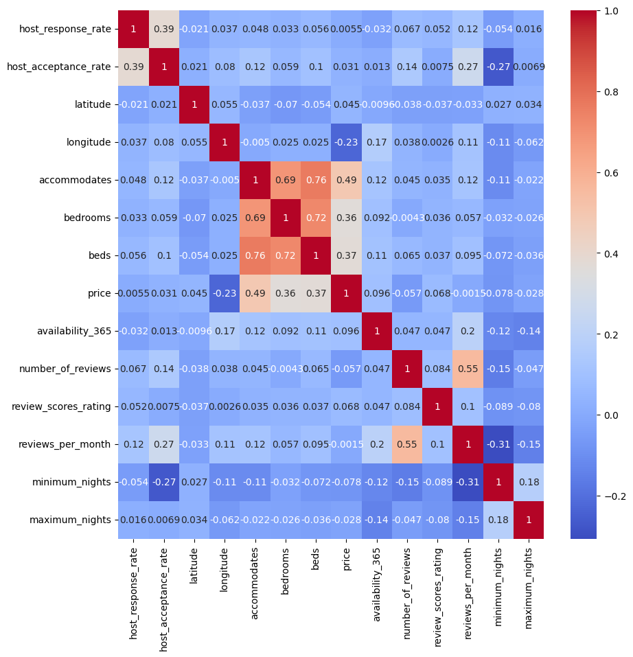
    


The correlation matrix shows some sort of correlation for price with bedrooms, beds and accomodates columns (since accomodates, beds, and bedrooms are highly correlated to ech other we can consider the accumulated effect of these colunms by using a cross-feature created by these columns). We will compare the effect of using/not using cross-feature on price prediction.

Before we start exploring categorical features we focus on the host_sice column:

Here is the distribution for host_since column:


```python
df.hist(column='host_since', bins=50, figsize=(5,5))
plt.show();

```


    
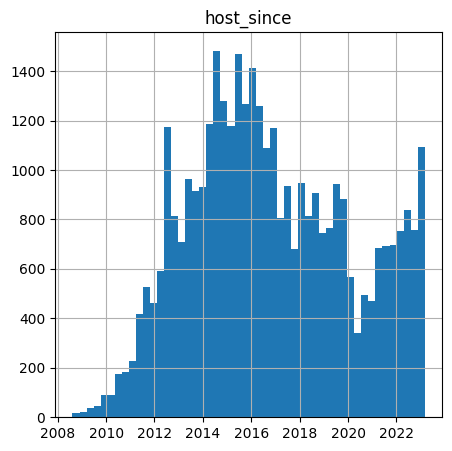
    


The above histogram plot shows the effect of Covid-19 Pandemic on the Aribnb new hosts. We can see by 2020 the number of registerations for Airbnb had decreased dramatically and again by ending the pandemic it increased to it's rate before pandemic value.

##### Categorical features exploring
**1- host_is_superhost**

Here is the pie chart to see the percentage of super hosts:


```python
counts = df['host_is_superhost'].value_counts()

# creating a pie chart with the counts
plt.pie(counts, labels=['Not a superhost', 'Superhost'], autopct='%1.1f%%')

plt.title('superhost/not superhost percentage')

plt.show();
```


    
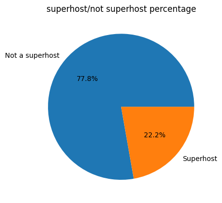
    


**2- room_type**

Let's see what room types there are in this dataset:


```python
print(df['room_type'].value_counts())
```

    Entire home/apt    19799
    Private room       16512
    Shared room          540
    Hotel room           156
    Name: room_type, dtype: int64
    

*shared room* and *Hotel room* counts are too fewer than other two types. Seems we do not have eough records for these types of listings to have good model to predict the price for them. We want to remove them from dataset to just focus on the *Entire home/apt* and *Shared room* 


```python
df = df[~df['room_type'].isin(['Shared room', 'Hotel room'])]
```

**3- neighbourhood_group_cleansed**

Here is the different neighbourhood groups (boroughs) distribution:


```python
print(df['neighbourhood_group_cleansed'].value_counts())
```

    Brooklyn         14357
    Manhattan        13939
    Queens            6144
    Bronx             1500
    Staten Island      371
    Name: neighbourhood_group_cleansed, dtype: int64
    

We can see that for the *Staten Island* there are just 371 listings and this will make it hard to have a good prediction for prices for this borough. We keep this listings but we need to deal with this issue later.

Let's plot the location of different neibourhood groups:


```python
colors = {'Bronx': 'red', 'Brooklyn': 'green', 'Manhattan': 'blue', 'Queens': 'purple', 'Staten Island': 'orange'}
fig, ax = plt.subplots()
for neighborhood_group in df['neighbourhood_group_cleansed'].unique():
    ix = df['neighbourhood_group_cleansed'] == neighborhood_group
    ax.scatter(df.loc[ix, 'longitude'], df.loc[ix, 'latitude'], c=colors[neighborhood_group], label=neighborhood_group, alpha=0.5, s = 3)
ax.legend()
ax.set_xlabel('Longitude')
ax.set_ylabel('Latitude')
plt.show();

```


    
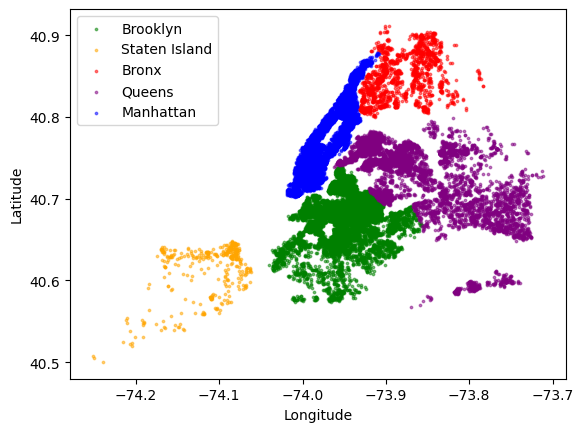
    


*Here we try some other iteresting visualizations:*

* room_types for different neghbourhoods:


```python
grouped = df.groupby(['neighbourhood_group_cleansed', 'room_type']).size().reset_index(name='counts')
pivoted = grouped.pivot(index='neighbourhood_group_cleansed', columns='room_type', values='counts')
total = pivoted.sum(axis=1)
percentages = pivoted.div(total, axis=0) * 100
percentages.plot(kind='bar', stacked=True)
plt.xlabel('Neighborhood Group')
plt.ylabel('Percentage')
plt.title('Percentage of Room Types by Neighborhood Group')
plt.legend(title='Room Type', bbox_to_anchor=(1.05, 1))
plt.show();

```


    
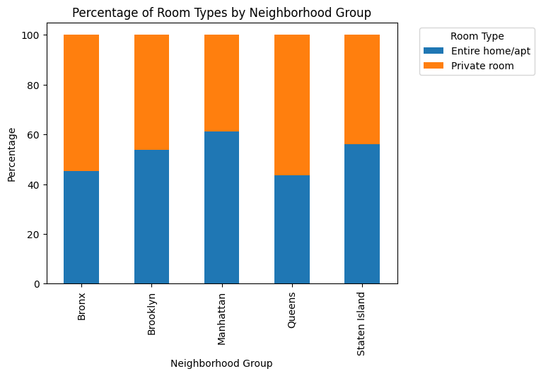
    


* Accommodates vs neighbourhood group


```python
grouped = df.groupby(['neighbourhood_group_cleansed', 'accommodates']).size().reset_index(name='counts')

pivoted = grouped.pivot(index='neighbourhood_group_cleansed', columns='accommodates', values='counts')

total = pivoted.sum(axis=1)
percentages = pivoted.div(total, axis=0) * 100

ax = percentages.plot(kind='bar', stacked=True)

ax.set_xlabel('Neighborhood Group')
ax.set_ylabel('Percentage')
ax.set_title('Percentage of Number of Accommodates by Neighborhood Group')
ax.legend(title='Number of Accommodates', bbox_to_anchor=(1.05, 1))

plt.show();
```


    
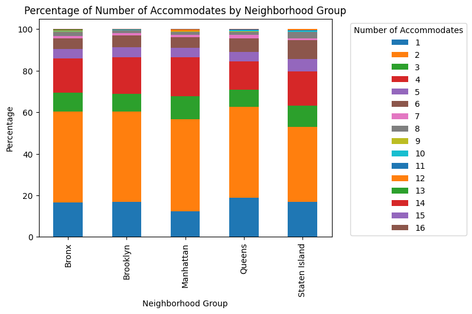
    


**4- neighbourhood_cleansed:**

First we want to know how many neighbourhoods we have in this listings and how many records we have for each of them:


```python
print(df['neighbourhood_cleansed'].value_counts());
```

    Bedford-Stuyvesant    2754
    Williamsburg          2321
    Harlem                1821
    Bushwick              1614
    Midtown               1458
                          ... 
    Country Club             2
    Richmondtown             2
    Breezy Point             1
    Lighthouse Hill          1
    Neponsit                 1
    Name: neighbourhood_cleansed, Length: 219, dtype: int64
    

Let's visualize these data:


```python
counts = df["neighbourhood_cleansed"].value_counts()


plt.figure(figsize=(40,10))
counts.plot.bar()

# set the plot title and axis labels
plt.title("Frequency of Airbnb listings by neighbourhood")
plt.xlabel("Neighbourhood")
plt.ylabel("Frequency")

# show the plot
plt.show();
```


    
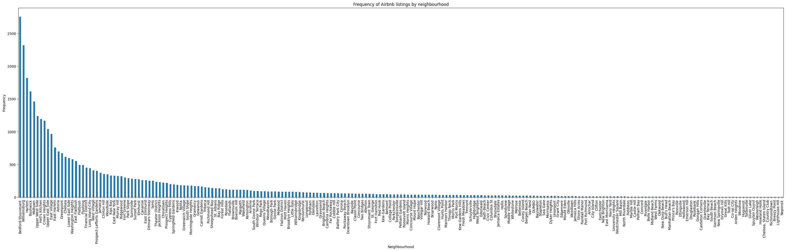
    


There are many neighbourhoods with too few samples which are insufficient to build a good model for price prediction.

Let's see how many neighbourhoods there are with less than 20 listings:


```python
counts = df.groupby('neighbourhood_cleansed').size()

# Filtering the groups to only include those with less than 20 records
less_than_20 = counts[counts < 20]

print(f"There are {len(less_than_20)} neighborhoods with less than 20 records.")
print(less_than_20.index.tolist())
```

    There are 71 neighborhoods with less than 20 records.
    ['Arden Heights', 'Arrochar', 'Bay Terrace', 'Bayswater', 'Belle Harbor', 'Breezy Point', "Bull's Head", 'Castle Hill', 'Castleton Corners', 'Chelsea, Staten Island', 'City Island', 'Clifton', 'Co-op City', 'Concord', 'Country Club', 'Dongan Hills', 'Douglaston', 'Dyker Heights', 'East Morrisania', 'Eastchester', 'Edgemere', 'Eltingville', 'Emerson Hill', 'Fieldston', 'Gerritsen Beach', 'Graniteville', 'Grant City', 'Great Kills', 'Grymes Hill', 'Holliswood', 'Howland Hook', 'Huguenot', 'Jamaica Hills', 'Lighthouse Hill', 'Manhattan Beach', 'Marble Hill', 'Midland Beach', 'Mill Basin', 'Morrisania', 'Mount Eden', 'Navy Yard', 'Neponsit', 'New Brighton', 'New Dorp Beach', 'New Springville', 'North Riverdale', 'Oakwood', 'Olinville', 'Pelham Bay', 'Port Richmond', "Prince's Bay", 'Randall Manor', 'Richmondtown', 'Riverdale', 'Rosebank', 'Rossville', 'Sea Gate', 'Shore Acres', 'Silver Lake', 'South Beach', 'Spuyten Duyvil', 'Stapleton', 'Todt Hill', 'Tottenville', 'Unionport', 'University Heights', 'West Farms', 'Westchester Square', 'Westerleigh', 'Woodlawn', 'Woodrow']
    

Here we try to know that for what neighbourhood groups these neighbourhoods belong:


```python

counts = df.groupby(['neighbourhood_cleansed', 'neighbourhood_group_cleansed']).size()

# Filter the groups to only include those with less than 100 records
less_than_100 = counts[counts < 20]

# Count the number of neighborhoods with less than 100 records in each neighbourhood group
group_counts = less_than_100.groupby('neighbourhood_group_cleansed').size()

# Print the number of neighborhoods with less than 100 records in each neighbourhood group
print("Number of neighborhoods with less than 100 records in each neighbourhood group:")
print(group_counts)
```

    Number of neighborhoods with less than 100 records in each neighbourhood group:
    neighbourhood_group_cleansed
    Bronx            19
    Brooklyn          6
    Manhattan         1
    Queens            9
    Staten Island    36
    dtype: int64
    

Again here we can see that for Staten Island we do not have enough data for each neighbourhood.

We want to remove Staten Island listings from our dataset. Because, our final goal is to try to build a good model for price prediction and we need a well scattered dataset to have a good model.


```python
df = df[df['neighbourhood_group_cleansed'] != 'Staten Island']
```

We also remove neighbourhoods with less that 20 listings in the dataset:


```python
neighborhood_counts = df['neighbourhood_cleansed'].value_counts()

neighborhoods_to_remove = neighborhood_counts[neighborhood_counts < 20].index.tolist()

# Filter the DataFrame to exclude records for the specified neighborhoods
df = df[~df['neighbourhood_cleansed'].isin(neighborhoods_to_remove)]

```

**5- Amenities:**

Here are top 20 the most repeated amenities:


```python
amenities_counts = df[unique_amenities].sum()
amenities_series = amenities_counts.sort_values(ascending=False)
print(amenities_series.head(20))


```

    Wifi                     32854
    Smoke alarm              32029
    Kitchen                  31932
    Essentials               29398
    Carbon monoxide alarm    27352
    TV                       27286
    Hangers                  25517
    Heating                  25051
    Hot water                23255
    Air conditioning         23053
    Iron                     22265
    Dishes and silverware    20240
    Shampoo                  20046
    Refrigerator             19743
    Cooking basics           18393
    Bed linens               17594
    Coffee                   17435
    Microwave                17296
    Fire extinguisher        16168
    Dedicated workspace      14996
    dtype: int64
    

Let's see what is the distribution of these common aqmenities between different room_types:


```python
common_amenities = list(df[unique_amenities].sum().sort_values(ascending=False).head(20).index)

# Create a new DataFrame with the common amenities and room type
common_amenities_df = pd.concat([df[common_amenities], df['room_type']], axis=1)

freq_df = common_amenities_df.groupby('room_type').sum()

print(freq_df)
```

                      Wifi  Smoke alarm  Kitchen  Essentials  \
    room_type                                                  
    Entire home/apt  17890        17903    18446       16951   
    Private room     14964        14126    13486       12447   
    
                     Carbon monoxide alarm     TV  Hangers  Heating  Hot water  \
    room_type                                                                    
    Entire home/apt                  15565  16885    14390    13275      13640   
    Private room                     11787  10401    11127    11776       9615   
    
                     Air conditioning   Iron  Dishes and silverware  Shampoo  \
    room_type                                                                  
    Entire home/apt             12884  13373                  12721    11845   
    Private room                10169   8892                   7519     8201   
    
                     Refrigerator  Cooking basics  Bed linens  Coffee  Microwave  \
    room_type                                                                      
    Entire home/apt         12164           11812       10882   11288      10570   
    Private room             7579            6581        6712    6147       6726   
    
                     Fire extinguisher  Dedicated workspace  
    room_type                                                
    Entire home/apt               8949                 8786  
    Private room                  7219                 6210  
    

## Price Analyzing

In this part we try to find the effect of different features on the listings' prices.

In the data exploring part we found a positive correlation between price and features: accomodates, beds and bedrooms. In this section we focus on relation of categorical variables and listing's prices:

* neighbourhood_group Vs price:

Here we plot median of price for different neibourhood_groups:


```python
median_prices = df.groupby('neighbourhood_group_cleansed')['price'].median()

median_prices.plot(kind='bar')
plt.title('Median Price by Neighborhood Group');
plt.xlabel('Neighborhood Group');
plt.ylabel('Median Price');
plt.show();
```


    
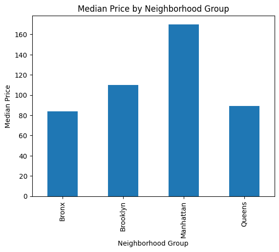
    


Easily and as we expect Manhattan has more expensive listings.

Let's consider room_type and neighbourhood together:


```python
sns.catplot(x="neighbourhood_group_cleansed", y="price", hue="room_type", kind="bar", data=df)
plt.title("Price by Neighborhood and Room Type")
plt.show();
```


    
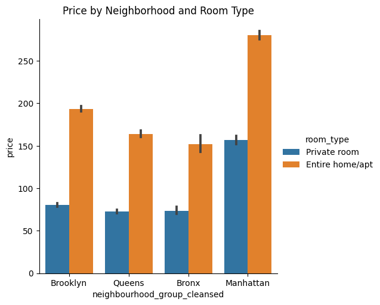
    


Here plot median price per neighbourhood and define the groups for better vidualization:


```python
plt.figure(figsize=(12, 8))
grouped_df = df.groupby(['neighbourhood_group_cleansed', 'neighbourhood_cleansed'])['price'].median().reset_index();
_ = sns.catplot(x="neighbourhood_cleansed", y="price", hue="neighbourhood_group_cleansed", kind="bar", data=grouped_df, height=5, aspect=5);
plt.xticks(rotation=90);
plt.title("Mean price per neighborhood and neighborhood group");
```


    <Figure size 1200x800 with 0 Axes>


    
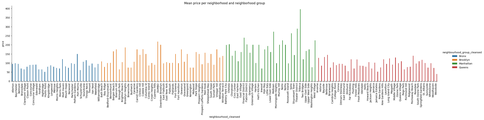
    


Here is the world Could presentation of median prices for nirghbourhoods but only for private room types:


```python
from wordcloud import WordCloud

private_rooms = df[df['room_type'] == 'Private room']
neighborhood_prices = private_rooms.groupby(['neighbourhood_group_cleansed', 'neighbourhood_cleansed'])['price'].median().reset_index()

neighborhood_dict = dict(zip(neighborhood_prices.neighbourhood_cleansed, neighborhood_prices.price))


wordcloud = WordCloud(width=800, height=800, background_color='white', colormap='summer', max_font_size=150).generate_from_frequencies(neighborhood_dict)

plt.figure(figsize=(8,8))
plt.imshow(wordcloud, interpolation='bilinear')
plt.axis('off')
plt.title('Word Cloud based on Mean price per neighbourhood for *Private rooms*')
plt.show();
```


    
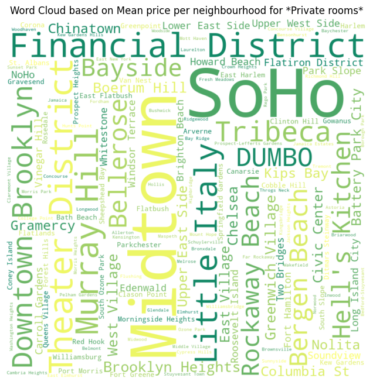
    


# Prediction:

In this section try to use different models to build a prediction model for lisitngs' price. 

Since want to test different encoding and techniques we create a copy or our cleaned:


```python
dataset = df.copy()
```

Based on what we observed in data exploration step we use these features for prediction (We decide to do not use anenities featues because it does not disperesed properly abd may cause negative effect on the accuracy of price prediction):
* price (As the output of model)
* room_type
* neighbourhood_group
* neighbourhood
* host_is_superhost
* accommodates
* bedrooms
* beds


```python
dataset =  dataset[['price', 'room_type', 'neighbourhood_group_cleansed', 'neighbourhood_cleansed', 'host_is_superhost', 'accommodates', 'bedrooms', 'beds']];
```

for simplicity we rename *neighbourhood_cleansed* and *neghbourhood_group_cleansed* tables:


```python
dataset = dataset.rename(columns={'neighbourhood_cleansed': 'neighbourhood'})
dataset = dataset.rename(columns={'neighbourhood_group_cleansed': 'neighbourhood_group'})
```

### 1- Linear Regression:

In this section we use linear regression model with different encoding types to build price prediction model.

* **combination of ordinal encoding and one-hot encoding**

First we use one-hot encoding to convert the categorical features (room type,  neighbourhood_group, host_is_super_host) to numerical features:


```python
from sklearn.preprocessing import OneHotEncoder
from sklearn.compose import ColumnTransformer

cat_cols = ["room_type", "neighbourhood_group", "host_is_superhost"]

# Creating one-hot encoder for categorical features
encoder = OneHotEncoder()
transformer = ColumnTransformer(
    transformers=[("cat", encoder, cat_cols)],
    remainder="passthrough"
);

encoded_cols = transformer.fit_transform(dataset)
feature_names = transformer.get_feature_names_out()  

dataset = pd.DataFrame(encoded_cols, columns=feature_names)


dataset
```


<div>
<table border="1" class="dataframe">
  <thead>
    <tr style="text-align: right;">
      <th></th>
      <th>cat__room_type_Entire home/apt</th>
      <th>cat__room_type_Private room</th>
      <th>cat__neighbourhood_group_Bronx</th>
      <th>cat__neighbourhood_group_Brooklyn</th>
      <th>cat__neighbourhood_group_Manhattan</th>
      <th>cat__neighbourhood_group_Queens</th>
      <th>cat__host_is_superhost_0.0</th>
      <th>cat__host_is_superhost_1.0</th>
      <th>remainder__price</th>
      <th>remainder__neighbourhood</th>
      <th>remainder__accommodates</th>
      <th>remainder__bedrooms</th>
      <th>remainder__beds</th>
    </tr>
  </thead>
  <tbody>
    <tr>
      <th>0</th>
      <td>0.0</td>
      <td>1.0</td>
      <td>0.0</td>
      <td>1.0</td>
      <td>0.0</td>
      <td>0.0</td>
      <td>1.0</td>
      <td>0.0</td>
      <td>143.0</td>
      <td>Canarsie</td>
      <td>2</td>
      <td>1.0</td>
      <td>1.0</td>
    </tr>
    <tr>
      <th>1</th>
      <td>0.0</td>
      <td>1.0</td>
      <td>0.0</td>
      <td>1.0</td>
      <td>0.0</td>
      <td>0.0</td>
      <td>1.0</td>
      <td>0.0</td>
      <td>30.0</td>
      <td>Canarsie</td>
      <td>1</td>
      <td>1.0</td>
      <td>1.0</td>
    </tr>
    <tr>
      <th>2</th>
      <td>0.0</td>
      <td>1.0</td>
      <td>0.0</td>
      <td>1.0</td>
      <td>0.0</td>
      <td>0.0</td>
      <td>0.0</td>
      <td>1.0</td>
      <td>89.0</td>
      <td>Sheepshead Bay</td>
      <td>2</td>
      <td>3.0</td>
      <td>1.0</td>
    </tr>
    <tr>
      <th>3</th>
      <td>0.0</td>
      <td>1.0</td>
      <td>0.0</td>
      <td>0.0</td>
      <td>0.0</td>
      <td>1.0</td>
      <td>1.0</td>
      <td>0.0</td>
      <td>63.0</td>
      <td>Flushing</td>
      <td>3</td>
      <td>1.0</td>
      <td>1.0</td>
    </tr>
    <tr>
      <th>4</th>
      <td>0.0</td>
      <td>1.0</td>
      <td>0.0</td>
      <td>0.0</td>
      <td>0.0</td>
      <td>1.0</td>
      <td>1.0</td>
      <td>0.0</td>
      <td>82.0</td>
      <td>Whitestone</td>
      <td>2</td>
      <td>1.0</td>
      <td>1.0</td>
    </tr>
    <tr>
      <th>...</th>
      <td>...</td>
      <td>...</td>
      <td>...</td>
      <td>...</td>
      <td>...</td>
      <td>...</td>
      <td>...</td>
      <td>...</td>
      <td>...</td>
      <td>...</td>
      <td>...</td>
      <td>...</td>
      <td>...</td>
    </tr>
    <tr>
      <th>35611</th>
      <td>0.0</td>
      <td>1.0</td>
      <td>0.0</td>
      <td>0.0</td>
      <td>1.0</td>
      <td>0.0</td>
      <td>1.0</td>
      <td>0.0</td>
      <td>450.0</td>
      <td>Midtown</td>
      <td>2</td>
      <td>1.0</td>
      <td>1.0</td>
    </tr>
    <tr>
      <th>35612</th>
      <td>1.0</td>
      <td>0.0</td>
      <td>0.0</td>
      <td>0.0</td>
      <td>1.0</td>
      <td>0.0</td>
      <td>0.0</td>
      <td>1.0</td>
      <td>350.0</td>
      <td>Lower East Side</td>
      <td>5</td>
      <td>2.0</td>
      <td>3.0</td>
    </tr>
    <tr>
      <th>35613</th>
      <td>0.0</td>
      <td>1.0</td>
      <td>0.0</td>
      <td>0.0</td>
      <td>1.0</td>
      <td>0.0</td>
      <td>1.0</td>
      <td>0.0</td>
      <td>85.0</td>
      <td>East Village</td>
      <td>1</td>
      <td>1.0</td>
      <td>1.0</td>
    </tr>
    <tr>
      <th>35614</th>
      <td>1.0</td>
      <td>0.0</td>
      <td>0.0</td>
      <td>0.0</td>
      <td>1.0</td>
      <td>0.0</td>
      <td>1.0</td>
      <td>0.0</td>
      <td>208.0</td>
      <td>Hell's Kitchen</td>
      <td>6</td>
      <td>2.0</td>
      <td>3.0</td>
    </tr>
    <tr>
      <th>35615</th>
      <td>1.0</td>
      <td>0.0</td>
      <td>0.0</td>
      <td>0.0</td>
      <td>1.0</td>
      <td>0.0</td>
      <td>1.0</td>
      <td>0.0</td>
      <td>125.0</td>
      <td>Lower East Side</td>
      <td>3</td>
      <td>3.0</td>
      <td>3.0</td>
    </tr>
  </tbody>
</table>
<p>35616 rows × 13 columns</p>
</div>


then we use mean of each neighbourhood to encode it:


```python
neighbourhood_means = dataset.groupby('remainder__neighbourhood')['remainder__price'].mean()
dataset['neighbourhood_Encoded'] = dataset['remainder__neighbourhood'].map(neighbourhood_means)
dataset.head(3)
```


<div>
<table border="1" class="dataframe">
  <thead>
    <tr style="text-align: right;">
      <th></th>
      <th>cat__room_type_Entire home/apt</th>
      <th>cat__room_type_Private room</th>
      <th>cat__neighbourhood_group_Bronx</th>
      <th>cat__neighbourhood_group_Brooklyn</th>
      <th>cat__neighbourhood_group_Manhattan</th>
      <th>cat__neighbourhood_group_Queens</th>
      <th>cat__host_is_superhost_0.0</th>
      <th>cat__host_is_superhost_1.0</th>
      <th>remainder__price</th>
      <th>remainder__neighbourhood</th>
      <th>remainder__accommodates</th>
      <th>remainder__bedrooms</th>
      <th>remainder__beds</th>
      <th>neighbourhood_Encoded</th>
    </tr>
  </thead>
  <tbody>
    <tr>
      <th>0</th>
      <td>0.0</td>
      <td>1.0</td>
      <td>0.0</td>
      <td>1.0</td>
      <td>0.0</td>
      <td>0.0</td>
      <td>1.0</td>
      <td>0.0</td>
      <td>143.0</td>
      <td>Canarsie</td>
      <td>2</td>
      <td>1.0</td>
      <td>1.0</td>
      <td>125.434109</td>
    </tr>
    <tr>
      <th>1</th>
      <td>0.0</td>
      <td>1.0</td>
      <td>0.0</td>
      <td>1.0</td>
      <td>0.0</td>
      <td>0.0</td>
      <td>1.0</td>
      <td>0.0</td>
      <td>30.0</td>
      <td>Canarsie</td>
      <td>1</td>
      <td>1.0</td>
      <td>1.0</td>
      <td>125.434109</td>
    </tr>
    <tr>
      <th>2</th>
      <td>0.0</td>
      <td>1.0</td>
      <td>0.0</td>
      <td>1.0</td>
      <td>0.0</td>
      <td>0.0</td>
      <td>0.0</td>
      <td>1.0</td>
      <td>89.0</td>
      <td>Sheepshead Bay</td>
      <td>2</td>
      <td>3.0</td>
      <td>1.0</td>
      <td>142.928058</td>
    </tr>
  </tbody>
</table>
</div>


Now we build the linear regression model and caculate train and test accuracy for it: 


```python
from sklearn.model_selection import train_test_split
from sklearn.preprocessing import StandardScaler
from sklearn.linear_model import LinearRegression
from sklearn.metrics import r2_score


y = dataset['remainder__price']
X = dataset.drop(['remainder__neighbourhood', 'remainder__price'], axis=1)
features = [col for col in X]


X_train, X_test, y_train, y_test = train_test_split(X, y, test_size=0.2, random_state=42)

scaler = StandardScaler()
X_train_scaled = scaler.fit_transform(X_train)
X_test_scaled = scaler.transform(X_test)


# Fiting a linear regression model to predict yield using PC1 and PC2
reg = LinearRegression()
reg.fit(X_train, y_train);

# Computing the R^2 score for the training set
y_train_pred = reg.predict(X_train)
r2_train = r2_score(y_train, y_train_pred)

# Compute the R^2 score for the test set
y_test_pred = reg.predict(X_test)
r2_test = r2_score(y_test, y_test_pred)

print(f"R^2 score for training set: {r2_train}")
print(f"R^2 score for test set: {r2_test}");
```

    R^2 score for training set: 0.4034983624000258
    R^2 score for test set: 0.42369951603024003
    

As the result shoes the accuracy of the linear regression model for price prediction is not good enough. Here we try to use PCA and analyze its effect on the accuracy of the model:

We start with finding and plotting PCAs for our dataset:


```python
import numpy as np
from sklearn import preprocessing
from sklearn.decomposition import PCA

scaled_data = preprocessing.scale(X)  

pca = PCA(n_components=10)
pca.fit(scaled_data)
pca_data = pca.transform(scaled_data)

per_var = np.round(pca.explained_variance_ratio_* 100,decimals=1)
labels = ['PC' + str(x) for x in range(1, len(per_var) + 1)]

plt.figure(figsize=(5, 5))
plt.bar(x = range(1,len(per_var)+1),height=per_var,tick_label = labels)
plt.ylabel('Percentage')
plt.xlabel('Principal comp')
plt.title('Scree plt')
plt.show();
```


    
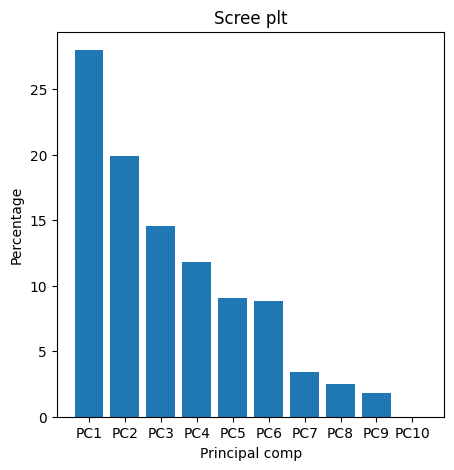
    


Let's see what feature have most participation of PCA1 and PCA2:


```python
def myplot(score,coeff,labels=None):
    xs = score[:,0]
    ys = score[:,1]
    n = coeff.shape[0]
    scalex = 1.0/(xs.max() - xs.min())
    scaley = 1.0/(ys.max() - ys.min())
    plt.scatter(xs * scalex,ys * scaley, c = y)
    for i in range(n):
        plt.arrow(0, 0, coeff[i,0], coeff[i,1],color = 'r',alpha = 0.5)
        if labels is None:
            plt.text(coeff[i,0]* 1.15, coeff[i,1] * 1.15, "Var"+str(i+1), color = 'g', ha = 'center', va = 'center')
        else:
            plt.text(coeff[i,0]* 1.15, coeff[i,1] * 1.15, labels[i], color = 'g', ha = 'center', va = 'center')

plt.figure(figsize=(10, 10))
plt.xlim(-1,1)
plt.ylim(-1,1)
plt.xlabel("PC{}".format(1))
plt.ylabel("PC{}".format(2))
plt.grid()

#Call the function. Use only the 2 PCs.

myplot(pca_data,np.transpose(pca.components_),features)
plt.show();
```


    
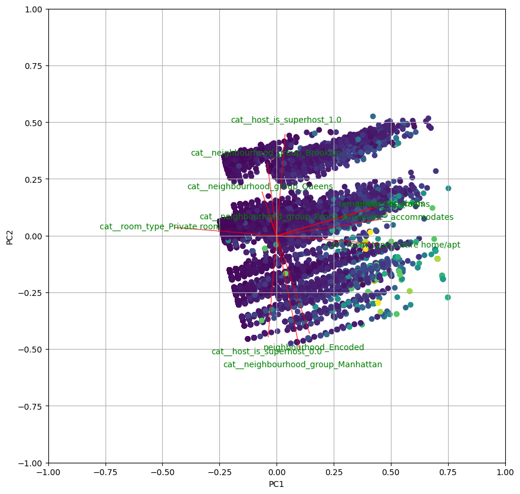
    


Lets see what is the effect of using PCA for linear regression:


```python

X_train, X_test, y_train, y_test = train_test_split(X, y, test_size=0.2, random_state=42)

scaler = StandardScaler()
X_train_scaled = scaler.fit_transform(X_train)
X_test_scaled = scaler.transform(X_test)

pca = PCA(n_components=12)
X_train_pca = pca.fit_transform(X_train_scaled)
X_test_pca = pca.transform(X_test_scaled)

# Fit a linear regression model to predict yield using PC1 and PC2
reg = LinearRegression()
reg.fit(X_train_pca, y_train);

# Compute the R^2 score for the training set
y_train_pred = reg.predict(X_train_pca)
r2_train = r2_score(y_train, y_train_pred)

# Compute the R^2 score for the test set
y_test_pred = reg.predict(X_test_pca)
r2_test = r2_score(y_test, y_test_pred)

print(f"R^2 score for training set: {r2_train}")
print(f"R^2 score for test set: {r2_test}");
```

    R^2 score for training set: 0.4035320755574746
    R^2 score for test set: 0.4239217350563893
    

The result shows that even PCA technique can not increase the linear regression model accuracy.

* **Just one-hot encoding**

Here we use one-hot encoding for all the categorical features and use linear regression for prediction. We also analyze using PCA on model accuracy:

- Without PCA


```python
dataset = df.copy()

#filtering our needed features
dataset =  dataset[['price', 'room_type', 'neighbourhood_group_cleansed', 'neighbourhood_cleansed', 'host_is_superhost', 'accommodates', 'bedrooms', 'beds']];
#Renaming to a simpler name
dataset = dataset.rename(columns={'neighbourhood_cleansed': 'neighbourhood'})
dataset = dataset.rename(columns={'neighbourhood_group_cleansed': 'neighbourhood_group'})

#one-hot encoding
room_type_cols = pd.get_dummies(dataset['room_type'])
dataset = dataset.merge(room_type_cols,left_index=True,right_index=True) # or concat(axis=1)
#one-hot encoding
neighbourhood_group_cols = pd.get_dummies(dataset['neighbourhood_group'])
dataset = dataset.merge(neighbourhood_group_cols,left_index=True,right_index=True) # or concat(axis=1)
#one-hot encoding
neighbourhood_cols = pd.get_dummies(dataset['neighbourhood'])
dataset = dataset.merge(neighbourhood_cols,left_index=True,right_index=True) # or concat(axis=1)

y = dataset['price']

#droping price and categorical columns
X = dataset.drop(['price', 'room_type', 'neighbourhood', 'neighbourhood_group'], axis=1)
features = [col for col in X]

X_train, X_test, y_train, y_test = train_test_split(X, y, test_size=0.2, random_state=42)

scaler = StandardScaler()
X_train_scaled = scaler.fit_transform(X_train)
X_test_scaled = scaler.transform(X_test)


# Fit a linear regression model to predict yield using PC1 and PC2
reg = LinearRegression()
reg.fit(X_train, y_train);

# Compute the R^2 score for the training set
y_train_pred = reg.predict(X_train)
r2_train = r2_score(y_train, y_train_pred)

# Compute the R^2 score for the test set
y_test_pred = reg.predict(X_test)
r2_test = r2_score(y_test, y_test_pred)

print(f"R^2 score for training set: {r2_train}")
print(f"R^2 score for test set: {r2_test}")
```

    R^2 score for training set: 0.4096697290997814
    R^2 score for test set: 0.42572343199730667
    

- With PCA

n_components=20


```python
pca = PCA(n_components=20)
X_train_pca = pca.fit_transform(X_train_scaled)
X_test_pca = pca.transform(X_test_scaled)

# Fit a linear regression model to predict yield using PC1 and PC2
reg = LinearRegression()
reg.fit(X_train_pca, y_train);

# Compute the R^2 score for the training set
y_train_pred = reg.predict(X_train_pca)
r2_train = r2_score(y_train, y_train_pred)

# Compute the R^2 score for the test set
y_test_pred = reg.predict(X_test_pca)
r2_test = r2_score(y_test, y_test_pred)

print(f"R^2 score for training set: {r2_train}")
print(f"R^2 score for test set: {r2_test}")
```

    R^2 score for training set: 0.31522493754617276
    R^2 score for test set: 0.32357739001481056
    

n_components=154 (maximum vlaue)


```python
pca = PCA(n_components=154)
X_train_pca = pca.fit_transform(X_train_scaled)
X_test_pca = pca.transform(X_test_scaled)

# Fit a linear regression model to predict yield using PC1 and PC2
reg = LinearRegression()
reg.fit(X_train_pca, y_train);

# Compute the R^2 score for the training set
y_train_pred = reg.predict(X_train_pca)
r2_train = r2_score(y_train, y_train_pred)

# Compute the R^2 score for the test set
y_test_pred = reg.predict(X_test_pca)
r2_test = r2_score(y_test, y_test_pred)

print(f"R^2 score for training set: {r2_train}")
print(f"R^2 score for test set: {r2_test}")
```

    R^2 score for training set: 0.40971089620777246
    R^2 score for test set: 0.4257116317672843
    

with small vlaue for n_components the accuracy decreases. 

The ont-hot encoding or label ncoding of categorical features does not make big differences on the model accuracy

### 2- decision Tree and Random Forest:

In this section we firt use decision tree model and then random forest model and compare them.

* **Decision Tree:**


```python
import pandas as pd
from sklearn.model_selection import train_test_split
from sklearn.preprocessing import LabelEncoder
from sklearn.tree import DecisionTreeRegressor
from sklearn.metrics import r2_score, mean_squared_error


dataset = df.copy()

#filtering our needed features
dataset =  dataset[['price', 'room_type', 'neighbourhood_group_cleansed', 'neighbourhood_cleansed', 'host_is_superhost', 'accommodates', 'bedrooms', 'beds']]
#Renaming to a simpler name
dataset = dataset.rename(columns={'neighbourhood_cleansed': 'neighbourhood'})
dataset = dataset.rename(columns={'neighbourhood_group_cleansed': 'neighbourhood_group'})

#numberical features list
num_features = ['price', 'host_is_superhost', 'accommodates', 'bedrooms', 'beds']


#categorical features list
cat_features = ['neighbourhood_group', 'neighbourhood', 'room_type']

encoder = LabelEncoder()

X_cat = dataset[cat_features]

for feature in cat_features:
    encoder.fit(dataset[feature])
    X_cat[feature] = encoder.transform(dataset[feature]);


encoded_data = pd.concat([pd.DataFrame(X_cat), dataset[num_features]], axis=1)

X = encoded_data.drop(['price'], axis = 1)
y = encoded_data['price']

X_train, X_test, y_train, y_test = train_test_split(X, y, test_size=0.2, random_state=42)


dt = DecisionTreeRegressor(max_depth=5, random_state=42)
dt.fit(X_train, y_train);


y_pred = dt.predict(X_test)


print("R^2 score:", r2_score(y_test, y_pred))
print("Mean squared error:", mean_squared_error(y_test, y_pred))

```

    R^2 score: 0.3987613734542126
    Mean squared error: 19772.712364813422
    

* **Random Forest:**


```python
from sklearn.ensemble import RandomForestRegressor

rf = RandomForestRegressor(n_estimators=100, random_state=42)
rf.fit(X_train, y_train);


y_pred = rf.predict(X_test)
r2 = r2_score(y_test, y_pred)
print("R^2 score:", r2)
```

    R^2 score: 0.46761721670529366
    

The result shows that for this dataset the Random forest method has better performance than the Descision Tree method.

### 2- SVM:

In this section we firt use decision tree model and then random forest model and compare them.

* **Decision Tree:**

In this part we use PCA and SVM to predict price:


```python
from sklearn.svm import SVC
from sklearn.metrics import confusion_matrix, accuracy_score, classification_report


dataset = df.copy()

#filtering our needed features
dataset =  dataset[['price', 'room_type', 'neighbourhood_group_cleansed', 'neighbourhood_cleansed', 'host_is_superhost', 'accommodates', 'bedrooms', 'beds']];
#Renaming to a simpler name
dataset = dataset.rename(columns={'neighbourhood_cleansed': 'neighbourhood'})
dataset = dataset.rename(columns={'neighbourhood_group_cleansed': 'neighbourhood_group'})

#one-hot encoding
room_type_cols = pd.get_dummies(dataset['room_type'])
dataset = dataset.merge(room_type_cols,left_index=True,right_index=True) # or concat(axis=1)
#one-hot encoding
neighbourhood_group_cols = pd.get_dummies(dataset['neighbourhood_group'])
dataset = dataset.merge(neighbourhood_group_cols,left_index=True,right_index=True) # or concat(axis=1)
#one-hot encoding
neighbourhood_cols = pd.get_dummies(dataset['neighbourhood'])
dataset = dataset.merge(neighbourhood_cols,left_index=True,right_index=True) # or concat(axis=1)

y = dataset['price']

#droping price and categorical columns
X = dataset.drop(['price', 'room_type', 'neighbourhood', 'neighbourhood_group'], axis=1)
features = [col for col in X]

X_train, X_test, y_train, y_test = train_test_split(X, y, test_size=0.2, random_state=42)

scaler = StandardScaler()
X_train_scaled = scaler.fit_transform(X_train)
X_test_scaled = scaler.transform(X_test)


n_pca_components = [20, 50, 100, 150]

scores = []

for n_comp in n_pca_components:

    pca = PCA(n_components=n_comp)
    X_train_pca = pca.fit_transform(X_train_scaled)
    X_test_pca = pca.transform(X_test_scaled)

    model=SVC(C=100,gamma='auto',kernel='rbf')
    model.fit(X_train_pca,y_train)
    y_pred=model.predict(X_test_pca)
    scores.append(accuracy_score(y_test,y_pred))
    print('n_comp: ', n_comp)

plt.plot(n_pca_components, scores, label='test')
plt.xlabel('Number of PCA components')
plt.ylabel('R^2 score')
plt.legend()
```

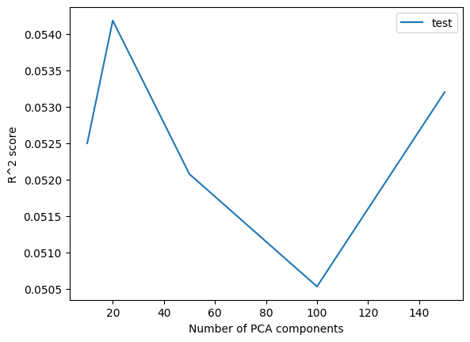
    


Here we summarize the results for different models:


```python
results = {'Linear Regression w/o PCA': 0.42,
           'Linear Regression with PCA (n_comp = maximum)': 0.42,
           'Linear Regression with PCA (n_comp = 20)' : 0.28,
            'Descision Tree' : 0.4,
            'Random Forest' : 0.46,
            'SVM' : 5}

from tabulate import tabulate


headers = ['Method', 'R^2 Score']
rows = []
for key, value in results.items():
    rows.append([key, value])

print(tabulate(rows, headers=headers))
```

    Method                                           R^2 Score
    ---------------------------------------------  -----------
    Linear Regression w/o PCA                             0.42
    Linear Regression with PCA (n_comp = maximum)         0.42
    Linear Regression with PCA (n_comp = 20)              0.28
    Descision Tree                                        0.4
    Random Forest                                         0.46
    SVM                                                   5
    

The result shows that the most successful method for price prediction on NYC Airbnb is *Randon Forest* model. but, averally, the final accuracy is not good for none of the models. The main reason is that the features we have in this dataset can not successfully describe the price distribtion and there are some other factors which are important for Airbnb price prediction like *Listing size*, *Age of listing* and *Furnitures*(amenities column is too incomplete to use it for prediction).
